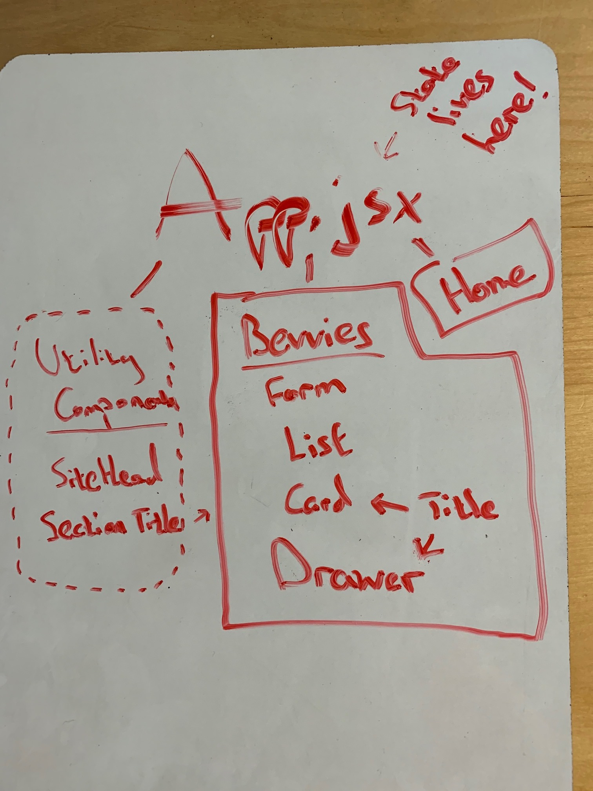

# Cocoa Loco

#### _A website for an imaginary hot cocoa bar- now with state! - Feb. 16, 2020_

#### By _Jaime Gensler_

## Description

_Cocoa Loco is a single page website built with React. It utilizes client-side routing and allows you to view different options for cocoa drinks! Features white chocolate cocoa, milk chocolate cocoa, and (the objectively superior in every single way) dark chocolate cocoa. Add your own bevvy with the new and improved version, using state (wow!). Note - bevvies with <40% cocoa content are considered white chocolate, 40-60% are considered milk, and >60% are considered dark._

## Setup/Installation Requirements

-   _Clone this github repository_
-   _CD into the repository_
-   _Run 'npm i'_
-   _Run 'npm start'_
-   _Enjoy!_

## Support and contact details

_For questions, comments, complaints, or confessions, please reach out to me at: <jaimegensler0@gmail.com>_

## Technologies Used

-   _JavaScript_
-   _React_
-   _React Router_
-   _Ant Design Components_

### License

This software is licensed under the MIT License.

Copyright (c) 2019 **_Jaime Gensler_**
